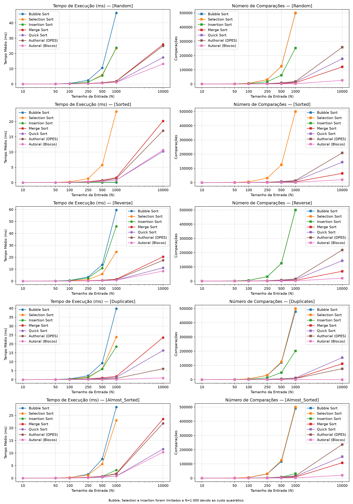
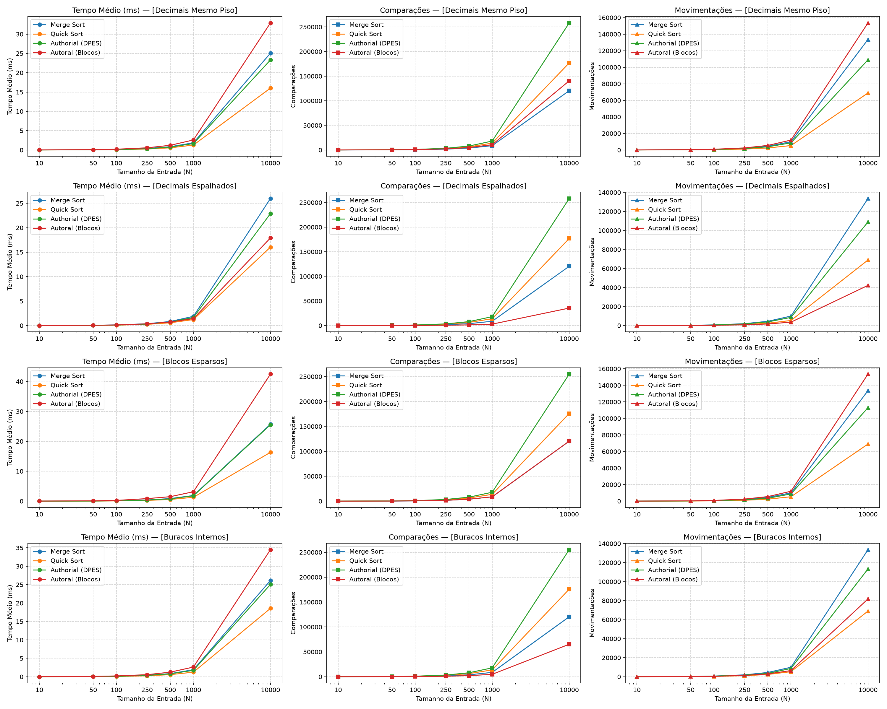

# Trabalho Prático 1 — Algoritmo Autoral de Blocos

**Autor:** Raphael do Amaral Nunes - 2510101041
**Disciplina:** Análise e Projeto de Algoritmos  
**Data:** 01/10/2026

## 1. Proposta

Minha ideia inicial era usar os próprios índices de um vetor para estabelecer a
ordem dos valores. O problema é que números muito distantes criariam muitas
posições vazias. Por isso, passei a dividir a faixa numérica em blocos.
É como separar números em prateleiras numeradas: o endereço já indica a ordem,
mas somente as prateleiras realmente usadas precisam existir.

Inicialmente considerei criar os blocos conforme os valores chegassem. Isso
criava outra dificuldade: se 250 fosse recebido antes de 240, seria necessário
aumentar o bloco existente ou criar outro usando uma regra dependente da ordem
da entrada. A solução foi definir faixas lógicas fixas de 100 em 100. Dentro de
cada faixa, o vetor físico cobre somente do menor ao maior piso encontrado.

Antes da distribuição, valores iguais são reunidos em um dicionário de
frequências. Assim, as etapas seguintes trabalham com valores diferentes, e
não com todas as ocorrências. Os blocos vazios entre faixas distantes não são
criados.

## 2. Funcionamento

A implementação considera listas de números inteiros e reais finitos. Valores
como `NaN`, infinito, textos, booleanos e outros objetos estão fora do domínio
definido para o algoritmo.

O algoritmo segue estas etapas:

1. Conta a frequência de cada valor.
2. Calcula o piso e o ID do bloco de cada valor diferente.
3. Descobre o menor e o maior piso presente em cada bloco.
4. Cria somente os vetores necessários.
5. Coloca cada par `(valor, frequência)` na posição correspondente.
6. Ordena os IDs dos blocos com Merge Sort.
7. Ordena localmente os valores diferentes que possuem o mesmo piso.
8. Reconstrói a saída repetindo cada valor conforme sua frequência.

O Merge Sort não recebe a entrada completa. Ele é usado somente onde a
indexação não determina a ordem: nos IDs dos blocos e nos valores que possuem
o mesmo piso. O auxiliar segue a forma iterativa padrão: combina sequências de
tamanho 1, 2, 4 e assim por diante até concluir a ordenação.

## 3. Pseudocódigo

```text
ORDENAR(entrada, B = 100)
    copiar entrada
    comparacoes = 0
    movimentacoes = 0

    contar a frequencia de cada numero

    para cada numero diferente:
        piso = floor(numero)
        id = piso // B
        atualizar menor e maior piso do bloco

    para cada bloco:
        criar vetor de maiorPiso - menorPiso + 1 posicoes

    para cada (numero, quantidade):
        piso = floor(numero)
        id = piso // B
        indice = piso - menorPiso
        adicionar (numero, quantidade) nessa posicao

    ids = MERGE_SORT(ids dos blocos)
    saida = lista vazia

    para cada id em ordem:
        percorrer as posicoes do bloco
        ordenar com MERGE_SORT os pares que possuem o mesmo piso
        adicionar cada numero na saida conforme sua quantidade

    retornar saida, comparacoes, movimentacoes
```

## 4. Exemplo

Considere a entrada:

`[250, 50.7, -1.2, 50.2, 250, -1.8, 50.7]`

As frequências são `250: 2`, `50.7: 2`, `-1.2: 1`, `50.2: 1` e
`-1.8: 1`. Com blocos de tamanho 100, a distribuição fica:

| Bloco | Piso | Pares |
|---:|---:|---|
| -1 | -2 | `(-1.2, 1), (-1.8, 1)` |
| 0 | 50 | `(50.7, 2), (50.2, 1)` |
| 2 | 250 | `(250, 2)` |

Os IDs, encontrados na ordem `2, 0, -1`, são ordenados como `-1, 0, 2`.
Os pares que compartilham um piso também são ordenados. A saída é montada
da seguinte forma:

```text
[]
[-1.8]
[-1.8, -1.2]
[-1.8, -1.2, 50.2]
[-1.8, -1.2, 50.2, 50.7, 50.7]
[-1.8, -1.2, 50.2, 50.7, 50.7, 250, 250]
```

O programa registrou 9 comparações e 21 movimentações nessa execução.

## 5. Corretude

Durante a contagem, depois de processar os primeiros `k` elementos, o
dicionário possui exatamente a frequência de cada valor nesse prefixo. O
dicionário vazio representa corretamente o início; cada iteração altera apenas
a frequência do elemento lido; ao final, toda a entrada foi contada.

Na reconstrução, depois de visitar cada posição, a saída está ordenada e
contém exatamente as ocorrências das posições já visitadas. Isso é verdadeiro
para a saída vazia e continua verdadeiro porque blocos, posições e valores
locais são percorridos em ordem. Ao final, todas as posições foram visitadas.

As frequências garantem que nenhuma ocorrência seja perdida ou criada. Logo,
o resultado possui os mesmos elementos da entrada em ordem não decrescente.

## 6. Complexidade e propriedades

Sejam `n` a quantidade de elementos, `d` a quantidade de valores diferentes,
`b` a quantidade de blocos, `S` o total de posições alocadas e `d_i` a
quantidade de valores diferentes com o mesmo piso. O custo esperado é:

\[
T(n)=\Theta\left(n+S+b\log b+\sum_i d_i\log d_i\right)
\]

O tamanho padrão do bloco é constante e igual a 100. Portanto, `S` cresce no
máximo linearmente. O limite superior esperado é `O(n log n)` e o limite
inferior é `Ω(n)`, pois a entrada precisa ser lida e a saída precisa ser
escrita.

O melhor caso ocorre quando todos os elementos são iguais: `Θ(n)`. Para
inteiros aleatórios em uma faixa proporcional a `n`, o caso médio esperado é
`Θ(n log n)`. O pior caso esperado também é `Θ(n log n)`, podendo ocorrer
com muitos blocos ou muitos decimais diferentes no mesmo piso.

A implementação usa memória `Θ(n)` e não é in-place. Ela também não deve ser
considerada estável para registros, pois valores iguais são agrupados em uma
frequência e perdem sua identidade original.

Uma comparação é contada nos testes dos limites dos blocos e no Merge Sort.
Uma movimentação é contada na inserção de um par no bloco, nas escritas do
Merge Sort e nas inserções na saída. Operações internas do dicionário e a cópia
inicial não entram nesses contadores.

## 7. Relação com outros métodos

A contagem de frequências se aproxima do Counting Sort, mas sem criar um vetor
para toda a faixa de chaves. A divisão em grupos se aproxima do Bucket Sort,
mas os blocos são criados sob demanda e ajustados pelos extremos locais.

| Método | Tempo | Memória extra | Estável | In-place |
|---|---|---|---|---|
| Autoral de blocos | `Θ(n)` no melhor; `O(n log n)` esperado no pior | `Θ(n)` | não | não |
| Merge Sort | `Θ(n log n)` | `Θ(n)` | sim | não |
| Quick Sort | `O(n log n)` médio; `O(n²)` pior | depende da implementação | não | geralmente sim |
| Counting Sort | linear quando a faixa é limitada | depende da faixa | pode ser | não |
| Bucket Sort | depende da distribuição | depende dos baldes | pode ser | geralmente não |

A contribuição está na combinação de contagem antecipada, blocos
esparsos, vetores ajustados aos extremos, indexação pelo piso e ordenação por
comparação somente onde o índice não determina a ordem.

## 8. Metodologia experimental

Os experimentos foram executados em Python 3.12.10, no Windows, com Matplotlib
3.11.2. Foram usados os tamanhos 10, 50, 100, 250, 500, 1.000 e 10.000. Cada
medição foi repetida dez vezes e o gráfico apresenta a média.

O tempo foi medido com `time.perf_counter`. O coletor de lixo foi desativado
somente durante o trecho cronometrado. Em cada repetição, os algoritmos
receberam cópias da mesma entrada. As saídas foram conferidas com `sorted`.

Foram avaliadas entradas aleatórias, ordenadas, reversas, repetidas e quase
ordenadas. Bubble, Selection e Insertion foram limitados a 1.000 elementos por
causa do custo quadrático. Um segundo experimento avaliou decimais com o mesmo
piso, decimais espalhados, blocos esparsos e buracos internos.

## 9. Resultados



Em 10.000 elementos, os principais tempos médios foram:

| Distribuição | Blocos | Merge | Quick | DPES |
|---|---:|---:|---:|---:|
| Aleatória | 13,181 ms | 25,954 ms | 17,419 ms | 24,963 ms |
| Ordenada | 10,673 ms | 20,214 ms | 10,212 ms | 17,023 ms |
| Reversa | 8,388 ms | 20,360 ms | 11,132 ms | 17,420 ms |
| Repetidos | 0,949 ms | 23,591 ms | 16,311 ms | 6,126 ms |
| Quase ordenada | 10,361 ms | 23,563 ms | 11,591 ms | 21,822 ms |

O melhor resultado apareceu nos dados repetidos. A entrada possuía somente
cinco valores possíveis, então as etapas internas trabalharam com cinco pares,
embora a saída ainda exigisse 10.000 escritas. Nos inteiros aleatórios, a
indexação também foi favorável. A ordem inicial teve pouca influência, como
mostram os resultados próximos para ordenados e reversos.



O segundo experimento mostrou os limites do método:

| Distribuição | Blocos | Merge | Quick | DPES |
|---|---:|---:|---:|---:|
| Decimais no mesmo piso | 32,907 ms | 25,070 ms | 16,017 ms | 23,316 ms |
| Decimais espalhados | 17,915 ms | 25,977 ms | 16,032 ms | 22,896 ms |
| Blocos esparsos | 42,475 ms | 25,714 ms | 16,315 ms | 25,538 ms |
| Buracos internos | 34,503 ms | 26,142 ms | 18,562 ms | 25,067 ms |

Muitos decimais no mesmo piso exigem uma ordenação local grande. Muitos
blocos distantes exigem ordenar vários IDs. Buracos internos aumentam a
quantidade de posições vazias alocadas e percorridas. Portanto, a proposta é
mais adequada para inteiros ou entradas com muitas repetições, e não pretende
substituir os métodos clássicos em todos os cenários.

As comparações instrumentadas não incluem operações internas do dicionário.
Por isso, os tempos medidos no mesmo ambiente são a comparação mais direta, e
os contadores servem para ajudar a explicar o comportamento.

## 10. Validação

O algoritmo passou nos cenários da suíte fornecida: vazio, unitário, ordenado,
reverso, repetidos, negativos, decimais, aleatórios e quase ordenados. A suíte
principal executou 71 testes. Outros 10 testes verificaram fronteiras de
blocos, decimais com o mesmo piso, valores distantes, diferentes tamanhos de
bloco e uma entrada com 10.000 elementos.

## 11. Declaração de autoria e uso de IA

Minha ideia inicial era usar os próprios índices de um vetor para estabelecer a
ordem dos valores. Percebi que números muito distantes criariam muitas posições
vazias e passei a dividir a faixa em blocos. Para evitar blocos dependentes da
ordem de chegada, defini faixas fixas de 100 em 100 e usei o menor e o maior
piso para criar apenas o trecho necessário de cada vetor.

Utilizei o OpenAI Codex como ferramenta de apoio. A IA auxiliou na revisão da
corretude, na análise dos benchmarks e na organização do relatório. Também
ajudou a resolver a ordenação dos IDs e dos decimais com o mesmo piso por meio
de um Merge Sort auxiliar, evitando aplicar o próprio algoritmo recursivamente.

Revisei as sugestões, mantive a estrutura baseada em blocos e decidi o escopo
das entradas. A IA também auxiliou na instrumentação, nos testes complementares
e na integração com o benchmark. Validei o resultado com a suíte do professor,
com testes específicos e com a comparação das saídas com `sorted`.

## 12. Conclusão

O trabalho resultou em uma ordenação híbrida que combina frequências,
distribuição por blocos e Merge Sort auxiliar. O método apresentou bons
resultados com inteiros e, principalmente, com repetições. Os experimentos
também mostraram claramente suas limitações com colisões de piso, blocos
isolados e buracos internos.

Mais importante que o tempo obtido foi compreender como a distribuição dos
dados altera o custo. A análise teórica e os testes confirmaram a corretude e o
limite esperado de `O(n log n)`.

## Referências

- NIST. [Counting Sort](https://xlinux.nist.gov/dads/HTML/countingsort.html).
- NIST. [Bucket Sort](https://xlinux.nist.gov/dads/HTML/bucketsort.html).
- NIST. [Merge Sort](https://xlinux.nist.gov/dads/HTML/mergesort.html).
- NIST. [Quick Sort](https://xlinux.nist.gov/dads/HTML/quicksort.html).
